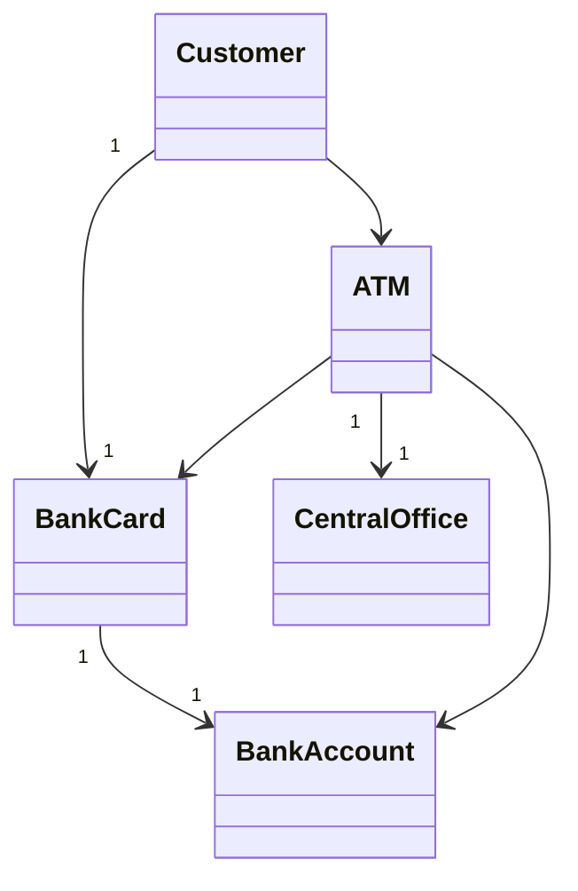

# ATM System - NetBeans Project


A complete ATM simulation system demonstrating banking operations with OOP principles.

## 📂 Project Structure
```
ATM_System/
├── nbproject/          # NetBeans configuration
├── src/
│   └── atmsystem/
│       ├── BankAccount.java
│       ├── BankCard.java
│       ├── Customer.java
│       ├── CentralOffice.java
│       ├── ATM.java
│       └── Main.java
└── test/              # (Optional for unit tests)
```

## 🚀 How to Run in NetBeans
1. **Import Project**:
   - `File → Open Project` → Select `ATM_System` folder
   - NetBeans will recognize the project structure automatically

2. **Run Main Class**:
   - Right-click project → `Run` (or press F6)
   - Or right-click `Main.java` → `Run File`

3. **Expected Output**:
   ```
   John Doe requested withdrawal of $200.0
   Dispensing $200.0
   Transaction report sent for card: 1111222233334444, amount: $200.0
   New balance: $800.0
   ```

## 🔍 Class Diagram (Mermaid)


## 🛠️ NetBeans Features Used
- Automatic package management
- Built-in Java compiler
- Standard project metadata
- IDE-optimized class structure

## 📋 Key Classes
| Class | Responsibility |
|-------|---------------|
| `BankAccount` | Manages account balance |
| `BankCard` | Handles card authentication |
| `Customer` | Represents ATM user |
| `ATM` | Processes transactions |
| `CentralOffice` | Verifies accounts |

## ⚙️ Building the Project
- **Clean & Build**: Right-click project → `Clean and Build`
- **Create JAR**: Output will be in `dist/` folder

## .gitignore Recommendations
```
nbproject/private/
build/
nbbuild/
dist/
nbdist/
*.class
```

## 📝 Extending the Project
1. Add new classes via NetBeans wizard:
   - Right-click package → `New → Java Class`
2. Create JUnit tests:
   - Right-click class → `Tools → Create Tests`

---

💡 **Tip**: Use NetBeans' built-in Git support (`Team → Git`) for version control!
```

### Key Features:
1. **NetBeans-specific** instructions
2. **Mermaid diagram** that renders on GitHub
3. **Clean structure** with table-based class overview
4. **.gitignore** recommendations for NetBeans
5. **Extension tips** using NetBeans features

### How to Use:
1. Save as `README.md` in your project root
2. Commit with your NetBeans project files
3. The diagram will automatically render on GitHub

Would you like me to add any specific NetBeans configuration details or screenshots?
